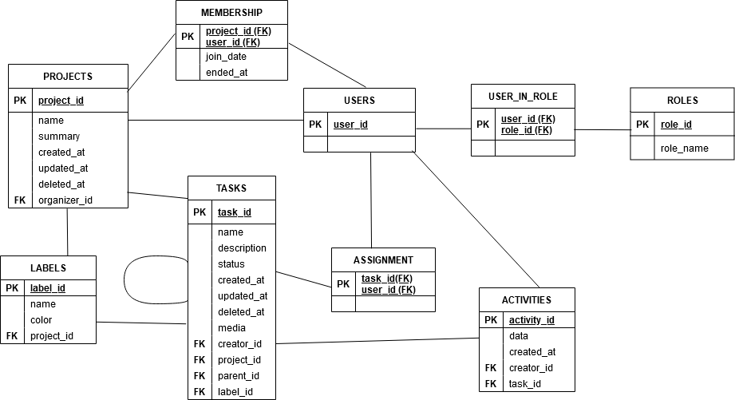
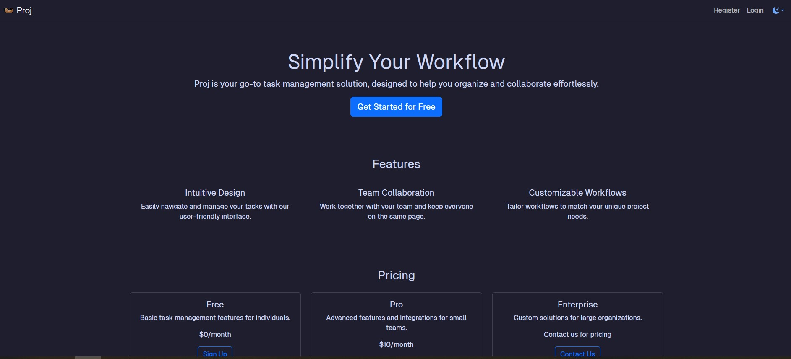
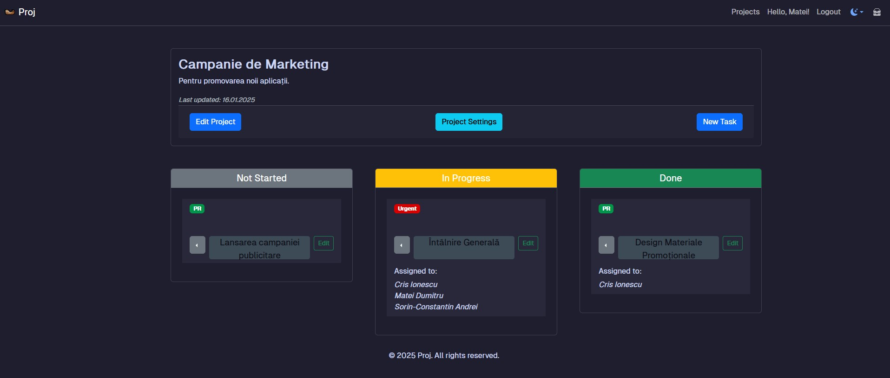
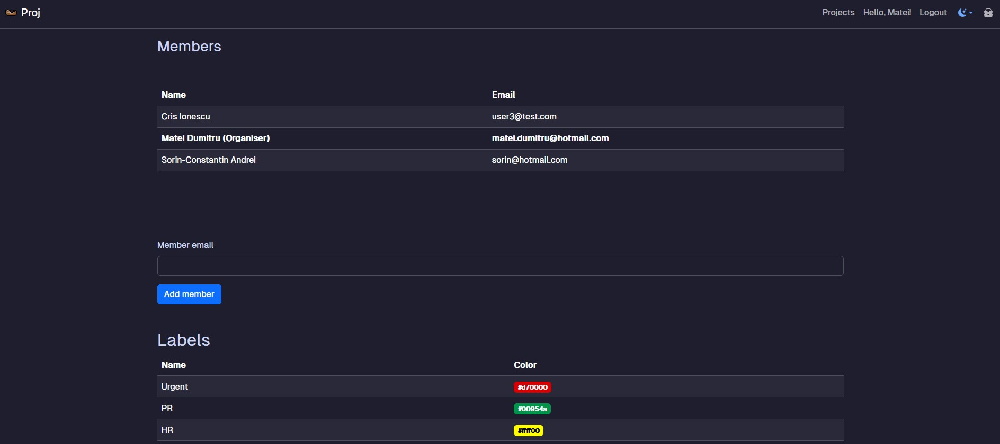
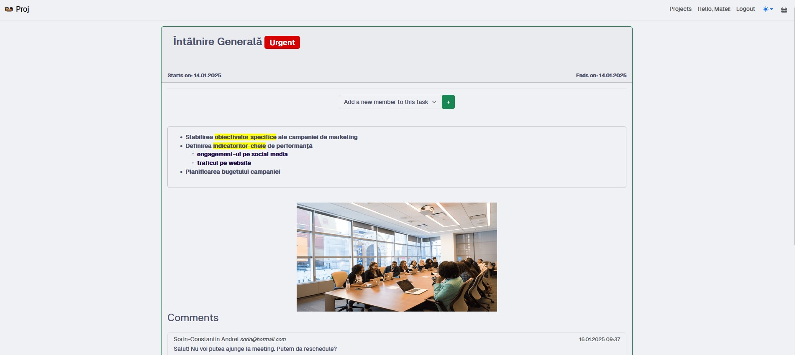

## Otterly 🦦
A task management application, built using ASP.NET Core 8.0 and C#. It allows users to create and manage projects, assign tasks, and collaborate efficiently. The platform supports multiple user roles, each with specific permissions.

#### Database Modelling 

### Features

#### User Roles
 - Unregistered User: Can only view the landing page and authentication forms.
 - **Member**: A registered user who can comment on tasks in their projects.
 - **Organizer**: A member who creates a project. This particular role was implemented in the backend, rather than being a proper role. 
 - **Administrator**: Has full control over the platform, including user and content management.

#### Functionality
 - a project organiser can add other members to their project. They can also create, modify and delete tasks, as well as assign those tasks to the project members.
 - the members can only access the tasks of those projects they are a part of. They can add comments to tasks in their projects, as well as change the task statuses.
 - the administrator can access any content across the platform, as well as grant or revoke the rights of other users 

  
#### Setup

`docker compose up db ` - starts the docker container
The application can be run from Visual Studio.

#### Snapshots
-> The Landing Page

-> The project's main page, where all of the tasks are listed

-> A Settings page, where the organiser can see the members of the project, the labels he created, and can send invites to other members

-> A page for each task, which contains a detailed description, multimedia files, a comment section (for the organizer, it also includes an "assign" button)
